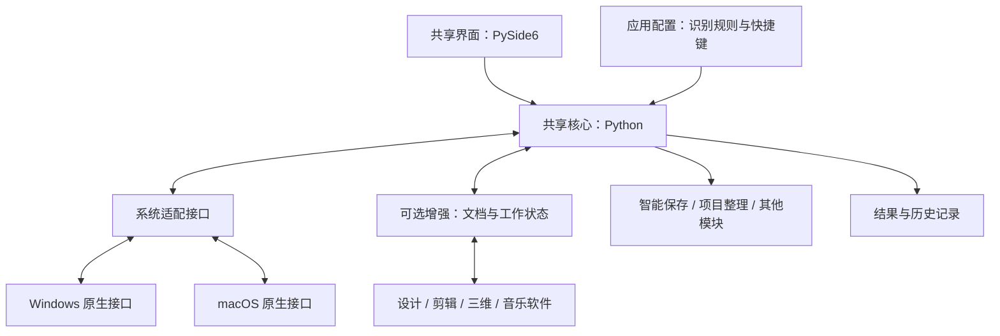

# 创作工具箱：跨平台构思草案

初稿日期：2026-09-07；实现进展更新：2026-09-09。已实现 Windows 0.1.0 通用原型并完成打包启动检查；完整功能愿景仍属草案。当前能力与测试边界以 README.md 为准，尚未创建 GitHub 远程仓库。

## 产品定位

一个常驻桌面的通用创作助手：覆盖平面设计、插画、剪辑、三维和音乐制作，围绕保稿、整理和交付，减少创作过程中的重复操作。用户已明确要求 Windows 与 macOS 双平台，应用范围包括 Adobe 软件、Cubase 以及其他创作软件；产品不以 Adobe 插件作为入口。

采用共享核心、双系统适配和可选应用增强的架构。原型已采用 Python 核心和 PySide6 界面；Windows 已构建，macOS 适配尚待实机验证。多端在当前阶段指 Windows/macOS 桌面端；跨设备设置同步是可选的独立功能。

第一项能力是智能保存：在用户允许的应用和文档中，等待合适的操作间隙保存，提供可解释状态，逐步加入版本回退。

## 已查到的参考

以下是产品官方描述或项目 README，尚未安装实测，不代表已验证兼容性。

| 参考 | 已公开的能力 | 可借鉴之处 |
| --- | --- | --- |
| [AutoSaver](https://www.door2windows.com/autosaver-save-the-file-you-are-working-on-automatically/) | 定时 Ctrl+S，按应用包含或排除，托盘运行 | 轻量交互、应用白名单 |
| [Autosaviour](https://docs.astutegraphics.com/autosaviour/autosaviour-overview) | Illustrator 自动保存、提醒和本地备份，按文档设置 | 首次保存保护、上次与下次保存状态 |
| [SaveGuard Pro](https://pewi21.github.io/SaveGuard-Pro/) | Photoshop 自动保存与独立备份、编辑停顿等待、历史状态检测、按保存耗时调整间隔 | 空闲检测已有先例，应研究跨软件管理与可解释性 |
| [JesseOrange/Autosave](https://github.com/JesseOrange/Autosave) | 面向 SAI 的保存消息或 Ctrl+S，可配置其他应用 | 通用执行方式与应用专属方式分离；旧脚本需要重新验证 |

借鉴交互和架构；复用源代码前单独核查许可证。

Adobe 原生能力也需要纳入设计。[Photoshop 文档](https://helpx.adobe.com/photoshop/desktop/save-and-export/save-files/file-saving-properties-and-preferences.html)将自动恢复描述为定时存储崩溃恢复信息。[Illustrator 文档](https://helpx.adobe.com/illustrator/desktop/troubleshoot/application-crash-issues/auto-backup-and-recovery-settings.html)说明 30.0 的背景保存还管理新的自动备份，并有适用条件；云文档另有自动保存。不能将所有版本、文档类型视为相同，也不能将恢复信息、保存原文件和历史版本混为一谈。

## 自动保存的行为草案

“窗口高光”暂理解为当前获得前台输入焦点的窗口。使用系统提供的窗口与进程信息判断，不以标题栏颜色或截图作为主要依据。

示例默认值，均待实测调整：距上次确认保存至少 120 秒，真实输入停止至少 8 秒，前台窗口稳定至少 1 秒。三个条件同时满足才进入保存检查。持续工作超过 10 分钟仍没有合适间隙，可轻提醒，不能越过状态检查强行保存。

增强模式的保存前检查（通用模式只能执行其中可观测的检查，能力边界见后文）：

1. 用户已为目标应用开启保护；当前前台窗口属于该应用，文档身份可确认。
2. 键盘、鼠标和已支持的数位笔输入已停止，没有按键或按钮保持按下。
3. 不在文字编辑、输入法组合、拖拽、自由变换、菜单、弹窗、渲染或录音等阻塞状态；对于该配置要求确认的状态，无法确认时暂缓。播放是否允许保存按应用实测配置。
4. 文档已经手动保存过，有可用保存目标；对于第一版，只开放验证过的本地原生格式。
5. 没有其他保存任务进行中；可读文档修改状态时，仅保存已修改文档。
6. 执行前再次核对输入、窗口及文档身份；发生变化就取消本次尝试。

通用模式的边界：外部工具不能凭“没有输入”确认所有编辑状态，窗口检查和按键发送之间也存在竞态。检测用户改过的快捷键或其他程序的拦截，不应承诺全局完整识别。先验证保存键配置；优先通过应用适配器执行保存。对于识别不可靠的应用状态，提供提醒或观察模式。

执行和结果必须分开：发送了保存请求不代表文件已经保存成功。插件回执与可确认的文档状态用于确认成功；文件变化仅作为辅助证据。无法确认时显示“已请求保存，结果未确认”，不能显示成功。保存失败使用有限重试和退避，不形成连续弹窗或按键循环。

未命名文档提示用户首次手动保存，不代填保存对话框。切换应用后不抢焦点；返回目标应用并稳定后重新检查。手动保存确认成功后重新计时。锁屏、休眠、应用退出后清除待执行操作。

## 架构草案

推荐 Python 共享核心 + PySide6 界面 + 双平台系统适配。核心管理规则、调度、应用配置、结果和工具模块；不直接引用 Windows/macOS 实现。系统层提供前台应用、窗口、输入空闲、按键状态、快捷键发送和权限状态的统一接口。Windows 可通过 ctypes/pywin32 调用系统接口；macOS 通过 PyObjC 调用 AppKit、Quartz 和辅助功能接口。PySide6 负责设置、托盘或菜单栏入口，界面可从 Qt Widgets 起步，若需更多视觉定制再采用 QML。

配置存本地 JSON，记录按需求使用 SQLite。只保存输入时间、必要状态和结果，不记录键入内容。系统事件回调尽快返回；大文件复制、扫描与压缩移到后台任务，避免占用界面和输入回调。通过低频检查结合事件通知控制开销；CPU、内存和音频场景中的影响需要实测，不承诺 Python 打包后自动获得低资源占用。

新增软件分三层：

| 层级 | 用户获得的能力 | 实现与限制 |
| --- | --- | --- |
| 通用配置 | 选择软件、保存快捷键、间隔和空闲阈值 | 不需要每个软件写插件；只保证实现已验证的窗口与输入检查，发出指令后显示结果未确认 |
| 增强适配 | 文档修改、忙碌、录音/播放状态或保存结果 | 依据具体应用可用的脚本、接口、辅助功能等逐项实现；不能假设每项都可读 |
| 文件保护 | 已保存文件的版本与恢复副本 | 独立处理可靠快照；磁盘备份不能保存尚在应用内存中的修改 |

每项状态采用“是 / 否 / 未知”，缺失能力不能当作空闲或保存成功。通用模式首次由用户为目标应用开启并验证快捷键；未检测到首次保存目标时不能保证避开另存弹窗。高风险工作流默认提醒或暂停，直到获得所需状态。插件窗口也需验证快捷键是否传递给主工程。

应用配置记录 Windows 程序身份或 macOS bundle ID、快捷键、间隔、能力需求和适配版本。工具显示兼容等级与等待原因；这允许覆盖广泛软件，同时保持准确的能力描述。基础配置只包含数据，不执行下载的任意代码。

### 保存快捷键设置

用户明确要求提供 Windows/macOS 保存快捷键切换选项。界面提供四项：自动跟随当前系统（默认）、Windows 风格 Ctrl+S、macOS 风格 ⌘+S、自定义组合键。选择不改变应用的实际快捷键绑定，只决定工具发送什么。

全局设置提供默认值，每个应用可选择“继承全局”或独立覆盖。高级配置可分别保存 Windows 和 macOS 的应用快捷键，避免未来配置同步时将同一原始按键组合套用到两端。在 Windows 上，macOS 风格若未建立明确有效的目标按键映射，应标为不适用；不能默认把 Command 当作 Windows 键注入。

自定义时显示“点击后按下保存快捷键”，录制仅在这个设置控件获得焦点时启用。保存为按键与修饰键的结构化数据；Command、Control、Option/Alt、Shift 分开表示，不以替换显示字符串实现系统适配。停止录制不向其他程序发送快捷键。

提供用户主动触发的测试入口：先提示切回目标应用，等目标窗口稳定后发送一次，并允许取消。测试发出指令不代表确认保存成功；无适配回执时由用户核对。自动模式是常见默认值，不能宣称已检测出应用实际快捷键或全部系统冲突。

Windows 提供 [GetForegroundWindow](https://learn.microsoft.com/en-us/windows/win32/api/winuser/nf-winuser-getforegroundwindow) 和 [GetLastInputInfo](https://learn.microsoft.com/en-us/windows/win32/api/winuser/nf-winuser-getlastinputinfo)，后者是会话输入信息，不能当作文档修改状态。需要实测数位笔与输入设备覆盖情况。[SendInput](https://learn.microsoft.com/en-us/windows/win32/api/winuser/nf-winuser-sendinput)受已有按键状态和进程权限等级限制；不应强行释放用户按住的键，也不默认要求管理员权限。

Photoshop 可研究 [UXP 保存与文档接口](https://developer.adobe.com/photoshop/uxp/ps_reference/)以及 [executeAsModal](https://developer.adobe.com/photoshop/uxp/2022/ps-reference/media/executeasmodal)；忙碌或模态冲突需要延后，不能把获取模态执行权当作全面的空闲证明。Illustrator 根据目标版本研究[官方脚本和插件接口](https://developer.adobe.com/illustrator/)，不能假设直接复用 Photoshop UXP。桌面程序和插件之间的通信方式与生命周期需要原型验证。

macOS 的 [NSWorkspace.frontmostApplication](https://developer.apple.com/documentation/appkit/nsworkspace/frontmostapplication)可识别前台应用；窗口与控件需要另取信息。[CGEventSource](https://developer.apple.com/documentation/coregraphics/cgeventsource)提供输入事件时间等接口。[PyObjC](https://pyobjc.readthedocs.io/en/latest/index.html)提供 Python 与 macOS 框架桥接。控制其他应用通常需要用户授予[辅助功能权限](https://support.apple.com/en-gb/guide/mac-help/mh43185/mac)；具体监听实现可能需要[输入监控权限](https://support.apple.com/en-gb/guide/mac-help/mchl4cedafb6/mac)。仅为窗口身份和输入时间判断，不默认采用截屏识别。

## 音乐与剪辑工作流

鼠标键盘空闲时，用户仍可能演奏 MIDI、录音、听回放、观看预览或渲染。不能只看音量或声音来判断录音；静音录音也是录音。也不能假设 OS 输入计时覆盖 MIDI 控制器或所有数位笔设备。

Cubase 等 DAW 配置应支持“录音期间暂停保护”；但实现自动判断之前，仅提供明确的手动暂停/恢复或提醒模式，不虚构已获得宿主传输状态。后续研究可用的官方接口、控制协议或辅助功能暴露信息，不为检测输入而独占 MIDI 设备。剪辑和三维软件同样针对播放、导出与渲染设置可验证的规则。

[Cubase Pro 15 官方自动保存文档](https://www.steinberg.help/r/cubase-pro/15.0/en/cubase_nuendo/topics/project_handling/project_handling_about_the_auto_save_option_c.html)说明其本身支持定时保存工程副本；是否启用工具箱自动保存，应与宿主原生机制协调。工程文件版本不等于完整项目备份：音频、视频、贴图等引用素材需要独立的依赖收集或宿主归档流程。

## Windows 与 macOS 打包发布

共享 Python 源码与资源，但两个系统分别构建。[PyInstaller 官方文档](https://pyinstaller.org/en/stable/usage.html)明确要求多操作系统分别打包，它不是跨系统编译器。也可评估 Qt 官方的 [pyside6-deploy](https://doc.qt.io/qtforpython-6/deployment/deployment-pyside6-deploy.html)，其基于 Nuitka，输出 Windows .exe 或 macOS .app。首轮选择一个打包器验证，不并行维护多套流程。

- Windows：构建可执行程序与依赖，再按发行需要制作安装包。
- macOS：构建 .app，再制作承载它的 .dmg；DMG 是分发容器，不是对应 EXE 的程序格式。
- 分别处理 Windows x64、Mac Apple Silicon；若需要 Intel Mac，再验证对应包或 universal2。PyInstaller 的 [universal2](https://pyinstaller.org/en/stable/feature-notes.html#macos-multi-arch-support)要求相关 Python 与二进制依赖支持目标架构。
- 面向外部用户的 macOS 发布安排 Developer ID 签名与公证；参见[Apple 分发文档](https://developer.apple.com/documentation/xcode/packaging-mac-software-for-distribution)。Windows 发布也安排签名及干净环境安装验证。
- 同一 GitHub 仓库可以规划 Windows/macOS 分别构建的流水线；打包通过不能替代两端针对创作软件的交互实测。
- 用户安装发行包后无需自行安装 Python。打包器不会消除系统权限差异，也不会让全部软件自动兼容。

## 版本保护

保存原文件、另存备份、原生崩溃恢复分别展示。建议最终提供“自动保存原文件 + 可选版本保护”和“仅提醒”两种清晰模式，具体首版模式待用户选择。

备份需确认对应哪个文档版本及其完成状态。不要在创作软件仍写入文件时直接复制；需要可靠保存完成信号或应用支持的保存副本方式。覆盖前保留上一次已确认的磁盘版本，可以保护旧状态；保存后生成的快照记录新状态，两者不能混淆。文件大小暂时不变化不足以保证写入完成。

后续增加版本数量、总容量、保留周期限制，恢复默认另存副本。大文件的备份频率独立于保存频率；容量预算由用户配置，不在第一版承诺任意文件都能无感高频备份。

## 界面和功能发展

主入口：托盘图标；点击查看当前文档、最近确认保存时间、当前等待原因，以及“立即保存”“暂停保护”。设置按应用分组，每个应用有独立保存间隔、空闲阈值和保存模式。正常保存安静完成，只在失败或需要处理时提醒。

| 阶段 | 功能 | 目的 |
| --- | --- | --- |
| 可行性原型 | 只观察，不触发按键；记录何时会保存及等待原因 | 验证是否能正确避开操作 |
| 第一版 | Windows/macOS 通用应用配置、可设置保存键、空闲规则、暂停、能力与结果状态 | 验证跨系统核心及通用入口；设计、剪辑、音乐各选样本实测 |
| 第二版 | 版本历史、备份预算、恢复副本、逐应用适配 | 防止误覆盖并扩大覆盖面 |
| 后续 | 最近项目、项目文件夹模板、批量命名、常用导出预设 | 扩展到项目整理和交付 |
| 候选 | 取色与色板、参考图置顶、尺寸换算、快捷操作面板 | 通过实际使用反馈决定优先级 |

实际创作软件验收计划需覆盖：连续画笔、静止但按住鼠标或修饰键、数位笔接触、中文输入、文字图层、自由变换、打开和另存弹窗、快速切换应用及文档、大文件保存、只读文件、首次保存、锁屏恢复、权限不匹配，以及 MIDI 演奏、录音、播放、插件窗口焦点和渲染。25 项自动化测试已通过，不能替代这份实际软件验收清单。

## 仓库建议与下一轮讨论

仓库名可沿用 designer-toolbox，也可改为更覆盖创作领域的 creative-toolbox；公开性与创建时机等待用户选择。当前本地实现分为 core、controller、storage、platforms、ui、tests 和 tools，已准备双系统构建工作流文件，但尚未在 GitHub 执行。

下一轮最有用的信息：是否有可用于实测的 Mac 及其芯片类型；设计、剪辑、音乐领域各选哪些软件作为首批验证样本；保存原文件和保留历史的取舍。默认按独立本地运行设计，不需要账号或云同步。
