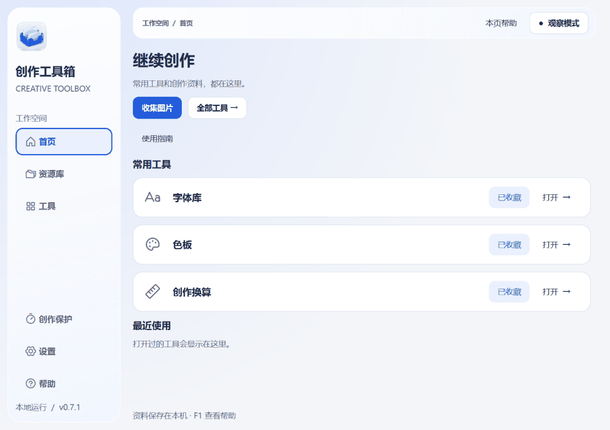
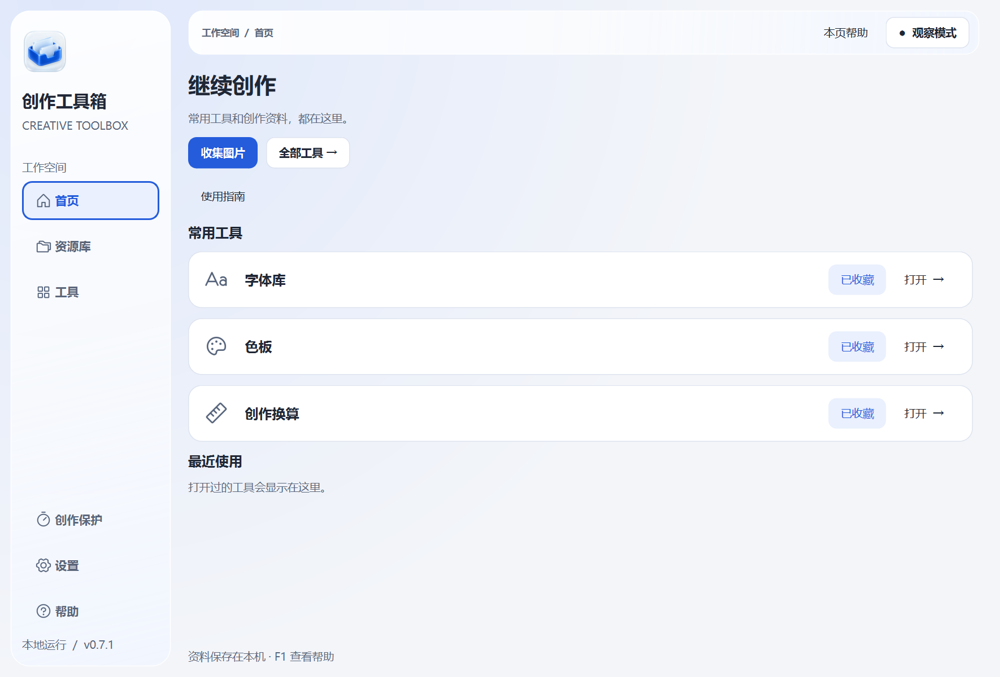
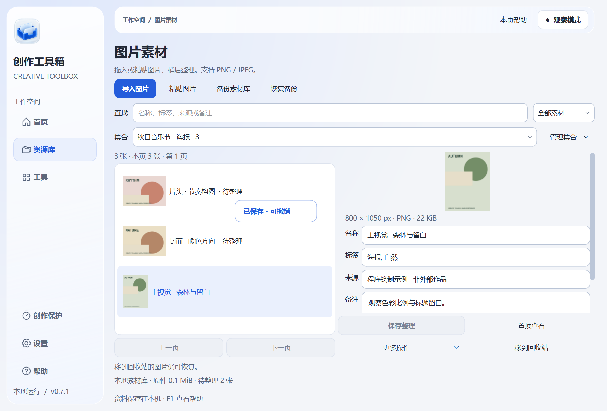
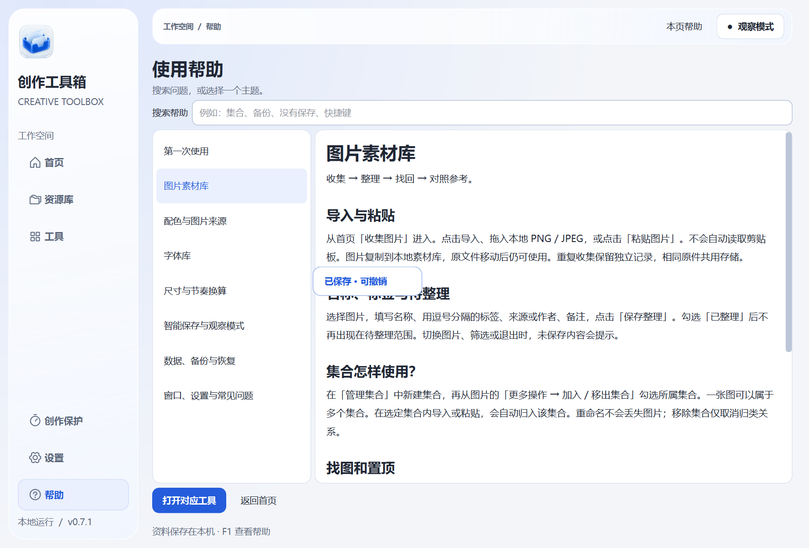
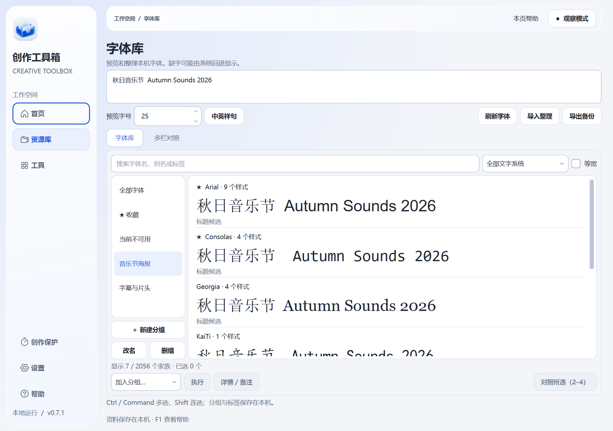
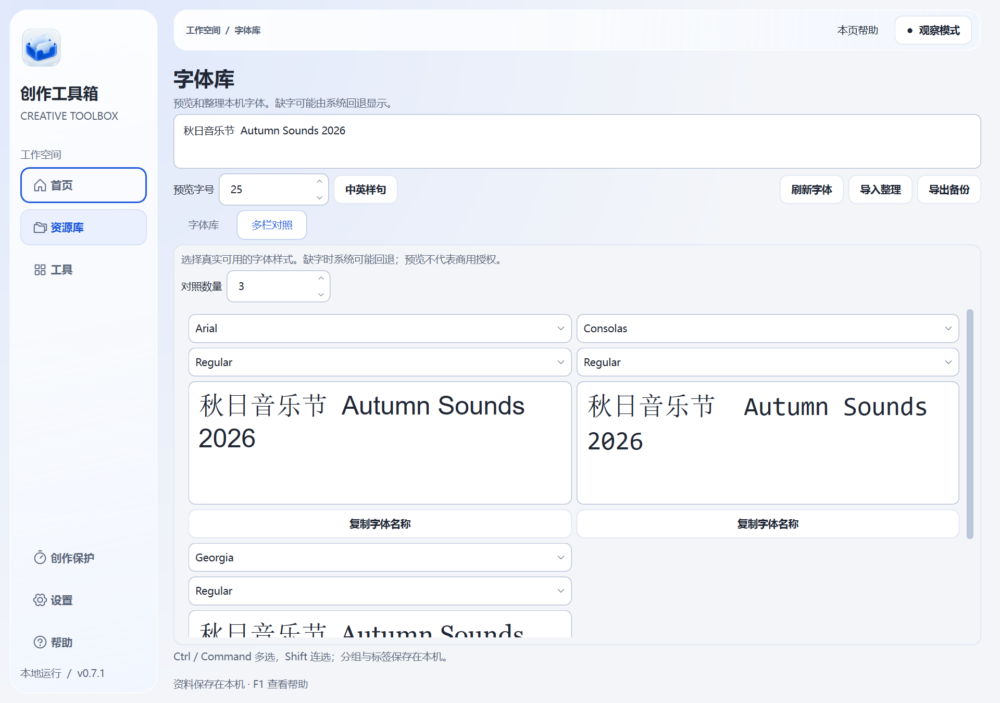
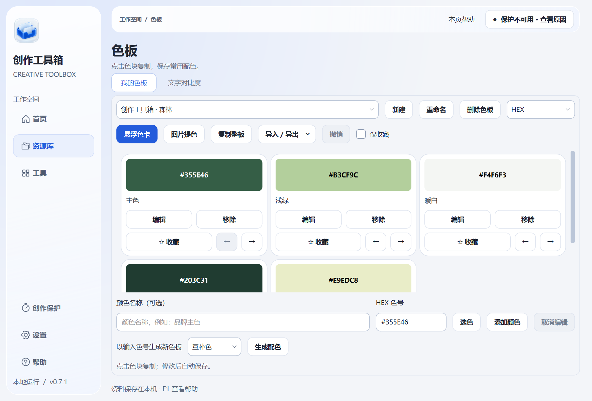

# 创作工具箱 · Creative Toolbox

**为设计、剪辑与音乐创作，把常用小工具放在一起。**

一个本地运行、跨应用使用的桌面工具箱，面向平面/UI 设计、视频剪辑、三维与音乐创作中的日常辅助任务。长期方向是覆盖「准备素材 → 正在创作 → 整理交付」的综合创作工作台。

**当前为 0.7.1 早期预览版**，已提供首页、工具搜索与收藏，以及智能保存、字体管理与对照、创作换算和色彩工具。图片库支持集合归类、来源整理、单图置顶、备份恢复和关联提色；新增离线帮助中心。多图参考板、项目管理、批量交付与音视频处理尚未实现。

[**下载 Windows 0.7.1 预览版**](https://github.com/Muamu925/creative-toolbox/releases/download/v0.7.1/CreativeToolbox-0.7.1-Windows-x64.zip) · [所有下载 / macOS 实验版](https://github.com/Muamu925/creative-toolbox/releases/tag/v0.7.1) · [English](README.en.md) · [功能路线](docs/FEATURE_ROADMAP.md)

## 0.7.1 的交互更新

页面短暂过渡、导航选中项平滑移动，复制与保存后显示轻提示。设置中可开启「减少动态效果」。标题和操作文案更简洁。

## 统一的界面

冷白＋钴蓝、统一圆角与线性导航图标，玻璃风格导航与不透明内容区。设置中可开启「减少透明效果」。这是跨平台绘制的近似材质，不是原生 Liquid Glass；图片、色号和字体样张保留原貌。[设计规范](DESIGN.md)

## 现在有哪些工具

| 模块 | 已实现的能力 | 使用场景 |
| --- | --- | --- |
| **首页与工具入口** | 工具搜索、收藏、最近使用、图片、字体与配色资源入口；页面按需加载 | 快速找到工具并继续上次工作 |
| **图片素材库** | PNG / JPEG 导入、拖放和主动粘贴；待整理、多集合归类、标签、来源、搜索、置顶参考、回收站、备份恢复与关联色板 | 收下参考图，创作时重新找回 |
| **帮助中心** | 上手指南、功能介绍、常见问题搜索、F1 / 本页帮助、直接打开工具 | 在需要时找到操作说明 |
| **创作保护** | 按应用配置保存快捷键、输入空闲时间、最短间隔；观察、提醒与自动保存模式 | 在创作间隙辅助执行保存；每次启动先进入观察模式 |
| **字体与文字** | 本机字体搜索、分组、标签、收藏、备注与备份；自定义样张、2–4 栏真实样式对照 | 按项目整理候选字体，再比较标题与正文效果 |
| **尺寸与节奏换算** | 毫米 / 像素 / PPI、等比缩放；BPM 对应普通、附点和三连音时长 | 计算出图尺寸、素材比例或延迟参数 |
| **色彩与对比度** | 自定义色板、悬浮色卡、图片提色、文字对比度、JSON / CSS / PNG 导出 | 取用项目颜色、检查文字搭配、分享色卡 |

这些工具可以独立使用，不要求先建项目或开启自动保存。工具箱不需要账号，图片素材、字体整理、配色库、应用规则和日志保存在本机，图片提色不上传图片。当前界面以中文为主。

## 两分钟开始使用

1. 下载 Windows ZIP，**完整解压**，打开 `CreativeToolbox/CreativeToolbox.exe`。无需安装 Python，整个文件夹需一起保留。
2. 从首页打开常用工具，或进入「工具」搜索“字体”“毫米”“BPM”等关键词；点击「收藏」加入首页。
3. 如需智能保存，先在「创作保护 → 应用规则」配置目标软件与快捷键，通过「保护状态」的观察模式检查触发时机，再用可丢弃文件试用。

第一次使用可点击首页「上手指南」，或侧栏「帮助」；在任一工具页按 **F1** 或点击「本页帮助」查看对应说明。

关闭主窗口后，若系统托盘可用，工具箱会继续运行。从托盘可以重新打开或退出。

从首页点击「收集图片」，或从「资源库 → 图片素材库」进入。可拖入 PNG / JPEG 或点击「粘贴图片」；图片复制到本地托管目录，不依赖原文件位置。详见 [图片素材库使用说明](docs/ASSET_LIBRARY.md)。

查看帮助中心：搜索问题、了解功能并直接打开工具

帮助完全离线可用，涵盖图片、配色、字体、换算、保存规则、备份和窗口操作。

新入口与数据说明见 [首页与工具使用指南](docs/WORKSPACE.md)。下方为新版字体与色彩工作台的实际窗口。

查看字体库示例：分组、标签与多栏对照

Windows 原生界面，使用本机字体与独立示例整理数据。选择多个字体后可批量加入分组、收藏或添加标签；同一字体可属于多个组。整理结果存储在本机 fonts.json，支持 JSON 备份合并，备份不包含字体文件。

当前只整理系统可用字体；未安装字体文件、系统安装与激活尚未实现。字体家族按本机完整名称匹配，跨系统备份中的不可用字体会保留记录。缺字可能由系统回退显示。详见 [字体库使用说明](docs/FONT_WORKSPACE.md)。

查看色彩模块示例：悬浮复制、收藏与导出

Windows 实际窗口，使用独立示例数据。色彩工具是综合工具箱中的一个模块。

支持带 / 不带 `#` 的 HEX、小写 HEX、RGB、RGB 纯数值、HSL，以及整板复制和 CSS 变量。颜色可命名、收藏、筛选、箭头排序；最近 20 次修改可在本次运行内撤销。收藏、顺序、上次色板与复制格式会保留。

## 接下来往哪里发展

以下均为规划能力，不包含在当前下载包中；顺序会根据试用反馈调整。

| 方向 | 下一步构思 |
| --- | --- |
| **入口进一步完善** | 按设计 / 视频 / 音乐场景筛选、可配置快速唤起 |
| **个人资源库** | 跨资源检索、统一备份、批量归类；继续连接字体与项目资料 |
| **项目与交付** | 项目规格卡、资源引用与项目副本、图片输出；后续加入参考板和批量命名 |
| **视频与动效** | 媒体信息、时码与帧数换算、抽帧，后续再做媒体转换 |
| **音乐与声音** | Tap Tempo、小节时长、音高与频率换算、音频规格检查 |
| **文字与效率** | 未安装字体目录、智能分组、字形覆盖检查、文案整理与常用文本片段 |

入口与基础第一版已完成，图片素材库已支持集合与关联配色；下一步是 **完善资料关联 → 组合项目与交付**。这些模块将共享资源引用与项目规格，同时保留直接打开小工具的方式。实施顺序、架构与验收见 [整体架构与发展方案](docs/ARCHITECTURE_PLAN.md)；全部候选能力见 [功能地图](docs/FEATURE_ROADMAP.md)。

## 平台与预览版状态

| 平台 | 当前状态 |
| --- | --- |
| Windows x64 | 便携 ZIP；本地独立程序启动和原生界面已检查，GitHub 自动构建 |
| macOS | 实验性 DMG，架构见文件名；GitHub 自动构建，尚需真机安装与交互验收 |
| Linux | 当前不支持 |

安装包未签名或公证。**智能保存发送快捷键不等于确认文档保存成功**；录音、MIDI、渲染、首次保存等状态不能通用判断，应先使用观察或仅提醒模式，并在可丢弃文件中测试。使用其他工具不需要开启自动保存。

颜色工具面向不透明 sRGB，提色结果为近似值，不用于印刷校样。字体缺字时可能由系统回退显示。

## 反馈与参与

- [报告问题](https://github.com/Muamu925/creative-toolbox/issues/new?template=bug_report.yml)：请说明系统、版本、操作步骤和实际结果。
- [分享使用反馈或需求](https://github.com/Muamu925/creative-toolbox/issues/new?template=feedback.yml)：最想省去的是哪个重复操作？
- [贡献说明](CONTRIBUTING.md) · [开发与构建](docs/DEVELOPMENT.md) · [功能路线](docs/FEATURE_ROADMAP.md)

当前有 140 项自动化测试，覆盖保存规则、字体整理、配色持久化、悬浮同步、换算、工具入口与故障降级，以及素材收集、集合升级、关联色板、帮助导航、备份校验和独立恢复；另覆盖外观持久化、图标与文字对比度。自动化测试不能代替所有创作软件的真实兼容性验证。

如果这个工具帮你省下了来回切换的时间，欢迎 Star 收藏，也欢迎告诉我们哪里还不顺手。

## 许可证

项目代码采用 [MIT](LICENSE) 许可证。安装包包含的 Python、Qt / PySide6 等第三方组件仍适用各自的许可证，相关文件随包提供。

## Star 增长历史

如果这个工具对你有帮助，欢迎点亮 Star。点击下方图表可查看详细增长历史。

<a href="https://www.star-history.com/?repos=Muamu925%2Fcreative-toolbox&amp;type=date">
  <picture>
    <source media="(prefers-color-scheme: dark)" srcset="https://api.star-history.com/chart?repos=Muamu925/creative-toolbox&amp;type=date&amp;theme=dark&amp;legend=top-left" />
    <source media="(prefers-color-scheme: light)" srcset="https://api.star-history.com/chart?repos=Muamu925/creative-toolbox&amp;type=date&amp;legend=top-left" />
    
  </picture>
</a>

图表由 [Star History](https://www.star-history.com/) 提供，数据更新可能存在缓存延迟。
