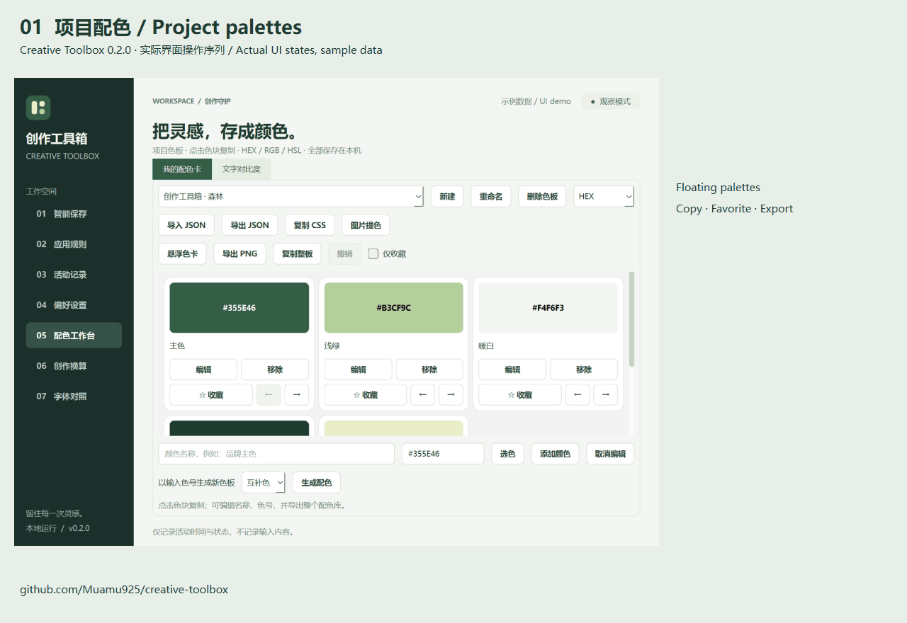
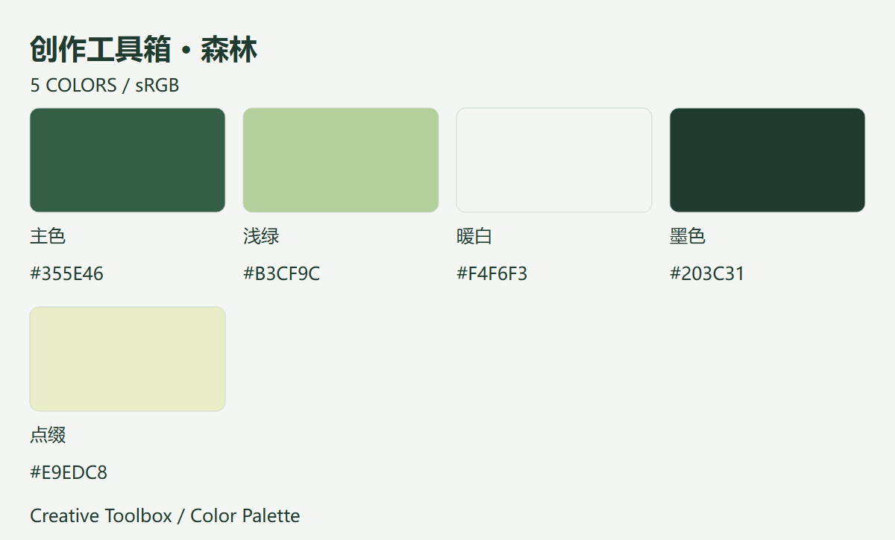

# 创作工具箱 · Creative Toolbox

**把配色卡放在创作软件旁边，点一下就能复制色号。**

一个本地运行的桌面创作工具箱：悬浮色卡、图片提色、字体对照、尺寸与 BPM 换算，以及可配置的智能保存规则。

[**下载 Windows 0.2.0 预览版**](https://github.com/Muamu925/creative-toolbox/releases/download/v0.2.0/CreativeToolbox-0.2.0-Windows-x64.zip) · [所有下载 / macOS 实验版](https://github.com/Muamu925/creative-toolbox/releases/tag/v0.2.0) · [English](README.en.md)

*实际界面操作序列，使用独立示例数据；约 16 秒循环。当前软件界面以中文为主。*

## 两分钟开始使用

1. 下载 Windows ZIP，**完整解压**，打开 `CreativeToolbox/CreativeToolbox.exe`。无需安装 Python，整个文件夹需一起保留。
2. 进入左侧「配色工作台」，使用示例色板，或通过「图片提色」选择本地图片。
3. 点击「悬浮色卡」，选择复制格式，再点击颜色。可以置顶或折叠面板，在创作软件中手动粘贴。

关闭主窗口后，若系统托盘可用，工具箱会继续运行。从托盘可以重新打开或退出。

## 可以帮你做什么

| 工具 | 适合的场景 |
| --- | --- |
| **悬浮色卡** | 把项目颜色放在手边，复制带 / 不带 `#` 的 HEX、小写 HEX、RGB、RGB 纯数值或 HSL |
| **配色管理** | 自定义色板、命名颜色、收藏筛选、箭头排序、撤销最近 20 次修改；JSON 导入导出、整板复制与 CSS 变量 |
| **图片提色与色卡导出** | 从本地图片提取最多六个近似主色，导出带名称与 HEX 色号的 PNG 色卡 |
| **文字对比度** | 预览文字与背景搭配，检查 WCAG AA / AAA 的文字颜色对比阈值 |
| **字体对照** | 用自己的文案对比两款本机字体，调整字号与粗体，复制字体名称 |
| **创作换算** | 毫米与像素、PPI、等比缩放；BPM 对应普通 / 附点 / 三连音时长 |
| **智能保存** | 为指定应用配置保存快捷键、输入空闲时间和最短间隔；每次启动先进入观察模式 |

配色库、应用规则和日志保存在本机。图片提色不上传图片，工具箱不需要账号。收藏、顺序、上次色板与复制格式会保留；撤销记录仅限本次运行。

## 平台与预览版状态

| 平台 | 当前状态 |
| --- | --- |
| Windows x64 | 便携 ZIP；本地独立程序启动和原生界面已检查，GitHub 自动构建 |
| macOS | 实验性 DMG，架构见文件名；GitHub 自动构建，尚需真机安装与交互验收 |
| Linux | 当前不支持 |

安装包未签名或公证。**智能保存发送快捷键不等于确认文档保存成功**；录音、MIDI、渲染、首次保存等状态不能通用判断，应先使用观察或仅提醒模式，并在可丢弃文件中测试。初次体验配色功能不需要开启自动保存。

颜色工具面向不透明 sRGB，提色结果为近似值，不用于印刷校样。字体缺字时可能由系统回退显示。

## 反馈与参与

- [报告问题](https://github.com/Muamu925/creative-toolbox/issues/new?template=bug_report.yml)：请说明系统、版本、操作步骤和实际结果。
- [分享使用反馈或需求](https://github.com/Muamu925/creative-toolbox/issues/new?template=feedback.yml)：最想省去的是哪个重复操作？
- [贡献说明](CONTRIBUTING.md) · [开发与构建](docs/DEVELOPMENT.md) · [功能路线](docs/FEATURE_ROADMAP.md)

当前有 47 项自动化测试，覆盖保存规则、配色持久化、悬浮同步、撤销、换算和 PNG 导出。自动化测试不能代替所有创作软件的真实兼容性验证。

如果这个工具帮你省下了来回切换的时间，欢迎 Star 收藏，也欢迎告诉我们哪里还不顺手。

## 许可证

项目代码采用 [MIT](LICENSE) 许可证。安装包包含的 Python、Qt / PySide6 等第三方组件仍适用各自的许可证，相关文件随包提供。

## Star 增长历史

如果这个工具对你有帮助，欢迎点亮 Star。点击下方图表可查看详细增长历史。

<a href="https://www.star-history.com/?repos=Muamu925%2Fcreative-toolbox&amp;type=date">
  <picture>
    <source media="(prefers-color-scheme: dark)" srcset="https://api.star-history.com/chart?repos=Muamu925/creative-toolbox&amp;type=date&amp;theme=dark&amp;legend=top-left" />
    <source media="(prefers-color-scheme: light)" srcset="https://api.star-history.com/chart?repos=Muamu925/creative-toolbox&amp;type=date&amp;legend=top-left" />
    
  </picture>
</a>

图表由 [Star History](https://www.star-history.com/) 提供，数据更新可能存在缓存延迟。
