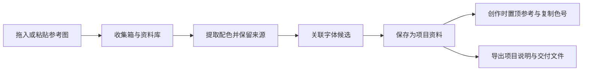
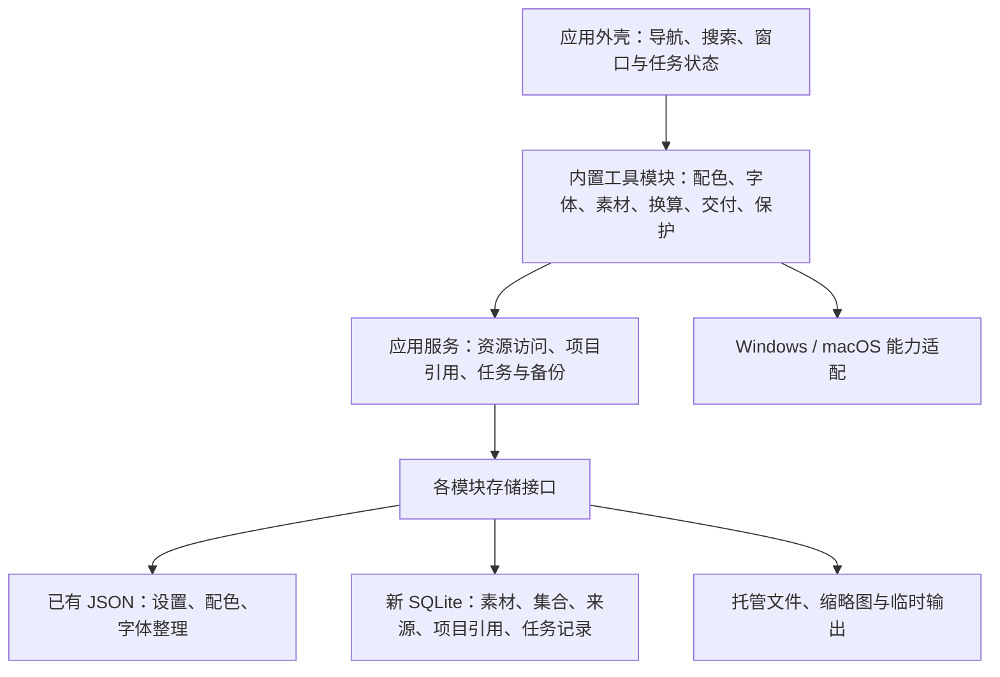

# 创作工具箱：整体架构与发展方案

评审日期：2026-09-17；代码基线：v0.3.0 / 1461965。本文是规划文档，不表示新功能已经实现。后续实施顺序以本文为准，功能地图用于列出候选能力，专项方案用于补充交互细节。

实施更新（2026-09-18）：0.4.0 已完成 A 阶段第一版，详见 [首页与工具入口](WORKSPACE.md)。下文评审观察描述 v0.3.0 基线。

实施更新（2026-09-21）：0.5.0 完成 B 阶段图片库第一步，详见 [图片素材库](ASSET_LIBRARY.md)。SQLite、稳定素材 ID、复制托管、后台导入、待整理、标签 / 来源、搜索、单图置顶、回收站、校验备份与独立恢复已落地。当前库位于应用数据目录，尚无自选库位置。集合、关联提色、跨模块完整备份及 C 阶段仍为规划，不视为 B 阶段全部完成。

## 1. 产品主线

定位：**帮助创作者积累自己的资料，在不同创作软件之间快速取用，并完成常见的辅助任务。**

围绕三件事发展：积累个人资料、组合项目方案、完成跨软件的小任务。服务设计、剪辑、三维和音乐用户；模块可以逐步增加，但每次发布要完成一条能实际使用的流程。

保留两种轻重不同的使用方式：临时复制色号、比较字体、计算数值时直接打开工具；长期整理素材与项目时再使用资料库和项目。首次启动不要求创建项目或账号。

产品价值应从真实流程判断，例如“收藏一张参考图，提取并保存配色，几天后从项目里一起找到它们”。单独增加几个按钮不能证明工具箱更有用。

## 2. 当前基础与需要调整的位置

| 已检查的现状 | 对后续发展的影响 | 建议 |
| --- | --- | --- |
| 主侧栏前四项是智能保存、规则、日志、偏好，字体 / 配色 / 换算各占一项 | 导航反映了开发先后顺序；通用工具越来越多时难以扩展 | 改为资源与任务入口，把规则和日志归入创作保护 |
| 主窗口在启动时构建所有工具，字体页立即枚举家族与属性 | 启动会随模块增长承担更多工作 | 内置工具注册表、按需创建页面；记录启动基线后再优化 |
| 系统 backend 初始化异常时，app.py 直接退出 | 保存能力故障会阻止本可独立使用的字体、配色等工具 | 系统能力逐项报告可用性；保护不可用时其余模块仍能启动 |
| PaletteModel 已连接主页面与悬浮窗口 | 共享状态已有良好起点 | 保留统一模型，项目引用也通过服务访问 |
| 色板主要以数组下标选择；校验器重建数据时只保留已定义字段 | 重排、删除或导入后，外部项目关联不能只靠位置；直接加 ID 也会被校验丢弃 | 项目引用上线前做明确的 schema 迁移与稳定 ID |
| 字体分组有 UUID，但字体记录以本机完整家族名称为键 | 跨平台同名字体不一定同一文件，改名也可能影响匹配 | 保留本机匹配语义；资源 ID 与平台字体描述分离 |
| 字体与配色独立 JSON，已有原子保存、验证和损坏保护 | 适合当前规模，但不能直接承担素材引用、批量任务和整个资料库的恢复 | 原有存储先保留；新素材与关系引入 SQLite，逐模块适配 |

代码依据：[主窗口](../creative_toolbox/ui.py)、[启动流程](../creative_toolbox/app.py)、[配色模型](../creative_toolbox/palette_model.py)、[配色校验与存储](../creative_toolbox/design_core.py)、[字体数据](../creative_toolbox/fonts/library.py)、[字体页面](../creative_toolbox/fonts/page.py)。这些观察并不等于已经进行性能基准测试。

## 3. 用户看到的四个入口

| 一级入口 | 主要内容 | 使用原则 |
| --- | --- | --- |
| **首页** | 收藏的工具、最近访问资料、继续项目、待整理数量与收集入口 | 帮用户继续工作；完整工具目录放在工具页，首页不重复铺开 |
| **资源库** | 素材、配色、字体；待整理、集合、标签、收藏与来源 | 三种资料有统一整理方式和各自适合的预览 |
| **项目** | 本次任务的参考、配色、字体、规格、目录与交付要求 | 项目引用个人资料，必要时创建独立副本 |
| **工具** | 换算、文字、图像、媒体、文件交付、创作保护 | 可以独立使用；支持收藏到首页 |

设置放在固定的辅助入口。任务队列通过全局进度按钮打开，创作保护通过明确的状态和暂停入口访问；规则、触发记录和诊断放在保护页面内。

分阶段显示已经可用的入口；项目或素材还未交付时，不用大量“敬请期待”的按钮占据界面。资源库负责长期资料，工具页负责一次操作；搜索或快捷入口都打开同一编辑器。现有字体 / 配色页面先通过新入口访问，不复制出另一套同名页面。

搜索分成“找工具”和“找资料”。首批只搜索工具名称、关键词及已保存的标题 / 标签，不默认扫描整盘，不把网页搜索、字体列表和本地文件混成不明来源的结果。

## 4. 资料库、参考板和项目的区别

- **资料库**保存长期积累的资源。集合用于整理，标签用于描述，一份资源可以属于多个集合。
- **参考板**保存视觉排列、缩放和局部备注，引用资料库素材。删除板上图片不删除原资源。
- **项目**保存一次创作的上下文：资源引用、字体候选、配色版本和用户填写的规格。

第一批素材仅覆盖 PNG / JPEG 与主动粘贴图片；其他格式在明确支持预览和导入边界后逐步加入。先做列表、大图预览和单图置顶；自由画板作为下一步展示能力，不成为收集功能的前置条件。

收集时不强制填写标签、集合或项目，先进入待整理。默认把图片复制到用户选择的本地资料库目录，导入前显示数量与估计占用；设置中可查看库的位置、已用空间与备份位置。源图移动不影响已收藏副本。大型视频或工程文件以后提供“链接原位置”方式，明确显示路径失效状态。

重复内容通过文件摘要识别，减少原件占用；同一内容可以有不同的收藏记录、来源网址与备注，不能因物理去重而覆盖这些整理信息。再次收集时提示已有内容，允许补充来源或另建记录。相似图片查找与字节相同的去重是不同功能，不能直接合并相似素材。

普通移出集合只删引用。素材删除先进入资料库回收站，并提示使用它的项目 / 参考板；清空回收站才执行实际文件清理。缓存单独管理，可以重建。

## 5. 个人配色与字体的下一步

配色系统围绕“保存使用经验”扩展：用途（主色 / 文字 / 背景）、风格标签、来源图片、搭配示例、项目独立副本。使用比例作为用户的构图备注，不当作通用审美评分。

从素材提色后，记录源素材 ID 与提取操作信息。用户可继续编辑色板，编辑结果与自动提取结果区分。文字对比度依然只针对约定颜色条件，不代替印刷或完整无障碍验收。

字体继续加强查找、比较、项目使用记录与备份。未安装字体目录、字符覆盖检查、样张输出进入后续扩展；系统安装和跨软件激活需要独立平台适配。

两者共享收藏、标签、项目引用和来源机制，但保留自己的领域规则。字体文件、家族、字重与可变实例不能当成色号列表处理；图片的哈希也不能代替用户命名的色板身份。

## 6. 先贯通一条完整流程

第一条重点流程：

这些节点按阶段实现，不要求先开发完整项目管理。图片收集、提色和单图置顶可先独立交付；项目关联和交付输出随后接上。

视频与音乐通过相同资料结构发展：分镜图与片头字体、封面图与字体、工程规格与导出要求。Tap Tempo、时码计算等纯计算可以小步加入工具页；媒体解码和宿主工程解析另行立项。

## 7. 技术结构：在现有 Python + Qt 上逐层扩展

采用本地模块化应用。运行一个桌面程序，保持模块之间明确的调用方式；不引入服务器来承担本机可以完成的整理工作。

依赖方向由界面指向服务，再到存储与系统能力；数据层不创建弹窗，模块也不通过找到另一个页面的控件来交换数据。界面只在操作成功保存后刷新确认状态。

内置注册表首版只需要稳定工具 ID、名称、关键词、页面工厂和能力要求。没有实际用例的扩展协议不预先实现；第一阶段不开放任意第三方代码加载。

建议逐步拆分：应用外壳、素材模块、项目服务、任务服务、备份服务。现有 PaletteModel 与 FontLibrary 继续工作，通过小范围适配加入这些服务，不为统一目录一次改写全部代码。

## 8. 数据身份和一致性

| 对象 | 稳定身份与关联规则 |
| --- | --- |
| 资料库 | UUID；资源引用同时记录库身份，路径变化不等于新库 |
| 素材记录 | UUID；标题、标签和来源可改，身份不变 |
| 文件内容 | 摘要识别相同内容，保存一个托管副本；多个来源单独关联 |
| 色板 / 颜色 | 稳定 ID；排序和重命名不改变项目引用 |
| 字体整理记录 | 稳定记录 ID + 本机完整家族描述；没有文件证据时不自动合并跨设备字体 |
| 文件字体（后续） | 文件摘要与集合内 face 索引；可变实例另含轴坐标 |
| 项目 / 集合 / 标签 | 各自 ID；项目引用资源，不复制全部原件 |

资源 ID 与内容摘要各司其职。统一的是最小引用方式，例如 `(资源类型, 资料库 ID, 资源 ID)`；不同模块仍保存自己完整的数据结构。SQLite 无法用外键直接约束 JSON 中的对象，引用解析与缺失检查由资源服务负责。

**迁移顺序：**先为现有工具提供读写接口；资源需要跨模块引用时，备份旧文件，再执行带版本号的 ID 迁移；校验器、撤销、导入合并和导出同时升级。新增字段不能在旧校验中静默丢失。旧版不能写回新版格式，恢复使用完整旧备份，不在新旧存储间双写。

现有 JSON 保持其模块的唯一真实来源。SQLite 先负责新素材和关系；搜索缓存可重建，不变成第二份可编辑的配色或字体库。以后确有跨对象事务需求时，再按模块整体迁移到同一 SQLite 库。

数据库事务不能覆盖 JSON 和文件系统。跨存储操作采用可恢复步骤：先准备记录 / 临时文件，成功写入资源，再提交可见引用；失败时保留恢复记录，启动后核对状态，不显示虚假的“全部完成”。只有处于可用状态的资源进入普通搜索结果。

导入素材时先写临时文件、验证与计算摘要、放入托管目录，再提交索引。数据库提交失败可能留下孤立文件，应由恢复扫描识别；不能把索引失败误判为允许删除其他资料。

## 9. 后台任务、系统能力和退出

任务统一记录：任务 ID、输入引用、状态、进度、输出、错误和取消请求。首批支持排队、执行、成功、失败、已取消；重启后未完成任务显示“中断”，由用户重试，不假装自动续跑已完成未知的文件操作。

文件遍历、摘要、缩略图与媒体任务在后台执行，UI 更新通过 Qt 信号回到主线程；列表按可见项渲染。线程处理常规 I/O，重解码或需要隔离的处理使用受控子进程，选择随实测调整。参考 [Qt 的 worker-object 与线程说明](https://doc.qt.io/qtforpython-6/PySide6/QtCore/QThread.html)。

并发、单文件大小、像素数、队列长度与缓存总量设明确上限。取消应停止后续处理并说明已完成输出；不能强制终止正在提交的数据操作。关闭主窗口继续进入托盘；退出应用前提示处理正在运行的任务，并按序保存和关闭服务。

平台接口报告功能是否可用与原因，例如窗口识别、空闲检测、按键发送、截图和全局快捷键。保存能力不可用时禁用相关操作，字体、配色和素材仍可工作。打开资料库不触发录屏或要求无关系统权限。

创作保护保留每次启动观察模式、显式开启自动保存、触发前复查目标等约束。高负载导入不能成为扩大自动保存权限或推断“宿主已完成保存”的理由。

## 10. 备份、恢复与跨设备

分别提供“整理信息备份”和“完整资料库备份”，说明是否含托管原件、是否仅记录外链、是否包含字体文件。缩略图通常可重建，不必进入完整备份。

完整备份应包含清单、版本、各数据快照和文件校验值。先协调暂停元数据写入，取得同一边界的 JSON 快照与 SQLite 快照；托管原件采用不可变内容存储，备份期间固定引用清单、延后垃圾清理，再完成复制与校验。成功后才标记完整。

SQLite 使用 [官方备份 API](https://www.sqlite.org/backup.html) 获取数据库快照，不能仅复制正在使用的一个 .db 文件就声称整个资料库一致。该 API 也不会替我们备份外部图片或 JSON。

恢复先到独立目录，校验并试开，用户确认后切换资料库。现有资料在恢复验证完成前保留；对路径失效和缺失资源给出清单。完整恢复保留库与资源 ID；合并到另一个库需要处理 ID 冲突、建立映射并重连引用。现有色板追加导入或字体分组合并不能直接代替整个项目的恢复。

资料库首版支持一个活动本地库。将当前运行库直接作为多设备网盘同步目录不是本方案的同步实现；尤其 SQLite WAL 不支持跨主机网络文件系统访问，见 [SQLite WAL 说明](https://www.sqlite.org/wal.html)。先支持导出 / 导入，后续同步再设计变更版本、冲突合并与删除记录。

## 11. 三个发展阶段与交付标准

版本号在进入实现时确定，本次不沿用旧文档中已经过期的“0.3 候选”承诺。

| 阶段 | 核心交付 | 验收条件 | 先不纳入 |
| --- | --- | --- | --- |
| **A：入口与基础整理** | 新首页、内置工具搜索 / 收藏、按需加载、创作保护故障隔离；建立性能与数据恢复基线 | 用户不建项目也能找到现有工具；模拟 backend 失败后字体 / 配色可用；旧数据与现有核心流程回归通过 | 全库迁移、素材批处理引擎、插件市场 |
| **B：个人资料积累** | 图片收集箱、集合 / 标签 / 来源、缩略图与搜索、复制托管、重复内容识别、回收站、单图置顶、关联提色；必要的稳定 ID 与任务基础 | 重启后找回素材；原文件移动仍可用；来源与色板不因重命名错连；导入中断可恢复；完整备份能恢复到独立目录 | 浏览器扩展、全格式预览、相似搜索、云同步 |
| **C：项目组合与交付** | 先做项目规格卡、素材 / 色板 / 字体引用、项目配色副本与基础说明导出；再接入一种图片输出流程，例如按长边等比缩放到新目录 | 两个项目副本互不污染；共享修改有提示；交付记录能追溯输入、参数与输出；取消 / 部分失败结果明确 | 自由参考画板、批量重命名、专有宿主工程自动归档、自动字体激活 |

每阶段可拆成多个独立小版本。A 的结构调整应保持范围有限，首先让 B 的导入 / 结果显示能接入，避免为未知功能建设巨大框架。参考画板与批量重命名保留为 C 之后的候选小版本，各自验收，不与首次项目关联捆成一次大改。

## 12. 再往后的增长方式

后续优先按完成的任务扩展：

- 参考与交付：多图参考板 → 保存布局与备注；命名预览 → 冲突检查与可验证撤销。这两条分别交付。
- 字体：未安装目录 → 字形检查 / 样张 → 经验证的平台激活。
- 视频：元信息 → 抽帧 / 联系表 → 代理与音轨提取。
- 音乐：Tap Tempo / 小节与频率计算 → 音频规格 → 经过明确标准的分析工具。
- 个人配色：语义用途 / 来源 → 版本比较 → 颜色搜索；ICC / 印刷工作流单独验证。
- 收集：浏览器扩展与截图 → 指定目录监视 → 可选的 OCR / 自动标签建议。

AI 能力、团队协作、云同步、插件市场和在线素材市场均待本地资料结构与备份成熟后按真实需求决定。所有自动建议允许用户确认与撤销，原始资料与用户整理结果保持可追溯。

## 13. 如何判断值得继续投入

首轮邀请 5–10 位创作者完成具体任务，记录他们是否找得到入口、能否理解结果、隔天能否找回资料，以及能否带回原创作软件继续使用。无需默认后台遥测。

工程侧先记录启动、首次打开字体页、导入代表性图片集、搜索与滚动的基线；在固定设备和相同样本下比较改动。性能数字实测后再定目标，不把本机字体枚举数量当作兼容性或速度保证。

硬性要求是保存失败不丢原库、资源引用不串错、取消后状态明确、恢复可验证。Windows 和 macOS 分别验收；自动构建成功不代替 macOS 真机安装、权限和全屏操作检查。

发布继续保留综合工具箱定位，首屏均衡展示当前模块；按工作流演示新能力。当前 66 项测试是 v0.3.0 的基础，后续应补充迁移、断电 / 中断恢复与平台降级测试，不能只增加单个按钮的检查。

## 14. 紧接着可执行的五项工作

1. 记录当前启动与字体页基线，列出必须保留的保存与数据行为。
2. 引入内置工具注册表和简洁首页，迁移导航，按需创建字体等页面。
3. 拆开平台能力与应用启动，验证保护不可用时其他工具正常工作。
4. 用隔离测试库实现一条“拖入图片 → 托管 → 列表预览 → 重启找回”的最小路径。
5. 为关联提色准备稳定 ID 迁移和恢复测试，然后加入集合 / 标签、来源与置顶。

原评审仅形成方案；后续实现状态以文首的实施更新和版本使用说明为准。v0.3.0 的历史下载包保持不变。
