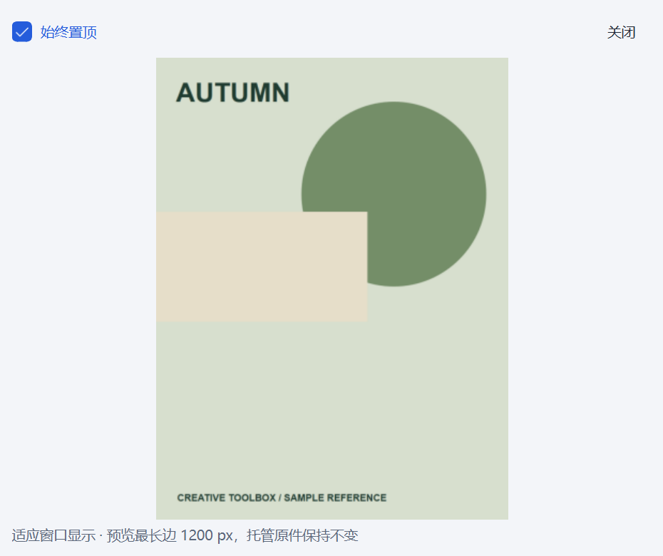
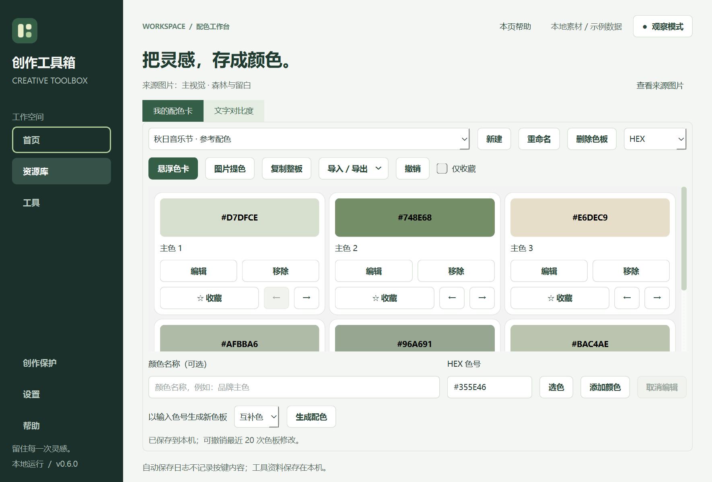

# 图片素材库 · 0.6.0

把参考图片保存在本机，之后按名称、标签、来源或备注找回。无需账号，不自动读取剪贴板，不抓取来源网页。

## 一次完整使用

1. 从首页「收集参考图片」，或资源库 / 工具搜索打开「图片素材库」。
2. 点击「导入图片」、拖入本地文件，或点击「粘贴图片」。文件导入前显示数量和估计占用；完成后进入待整理。
3. 选择图片，填写名称、逗号分隔的标签、来源或作者、备注；勾选「已整理」后点击「保存整理」。切换图片、筛选或退出时，未保存内容会提示保存 / 放弃 / 取消。
4. 查找支持多个关键词，匹配名称、标签、来源和备注。全部素材 / 待整理 / 回收站分别筛选；每页 60 条。
5. 双击图片或点击「置顶查看」，在独立窗口对照。可取消始终置顶，拖动窗口边缘调整大小。
6. 不需要的记录移到回收站，需要时切到回收站选择「恢复素材」。

截图使用程序绘制的示例参考图与隔离数据，不包含个人作品。

## 集合与关联配色

在「管理集合」中新建、重命名或移除集合。在图片的「更多操作 → 加入 / 移出集合」中勾选多个集合；取消勾选只移出该集合，不删除图片。集合可与搜索和待整理 / 回收站范围共同筛选；选定集合内的导入、粘贴在任务完成后自动归类。最多 200 个集合，每个名称 1–80 字，不允许忽略大小写后的重名。

从「更多操作 → 从图片创建色板」后台提取最多 6 个近似主色，预览并命名后保存到配色工作台。也可选择「打开关联色板」；同一素材可创建多个色板。配色工作台显示来源，并提供「查看来源图片」。来源按库 ID、素材 ID 和原件摘要定位，色板重命名、排序不影响来源；来源图片在回收站中也可跳转。另一个库或缺失图片会明确提示，不影响使用色号。

色板中的来源名称是创建时的快照，不自动跟随素材名称修改；修改色号也不会改动原图。JSON 配色导出保留来源标识，但不包含原图，需要分别备份图片库和配色库。新增关联色板采用配色 schema 2；旧版无法编辑新格式，请使用 0.6.0 或更新版本。

## 文件、重复图片与空间

- 只接收能解码的 PNG / JPEG；不递归导入文件夹、不接收文件链接。
- 单次最多 100 张、单张最多 50 MiB / 4000 万像素；库最多 10000 条记录、已索引原件合计 5 GiB。回收站记录计入上限。
- 每次收集获得独立 ID、名称与整理信息。相同文件内容共享一份托管原件；重复收集仍保留独立记录，避免丢失不同来源。
- 导入复制原图，不移动或更改源文件。之后原图移动、删除，不影响库内副本。
- 库位置默认在应用数据目录的 assets 下。界面底部显示原件占用，悬停查看完整库路径；原始文件路径保存在记录中，详情底部悬停可查看。
- 原件保留原始字节；预览最长边 1200 px，带有效色彩空间的预览转换为 sRGB。窗口预览不用于像素校验或印刷打样。
- 当前仅提供可恢复移除，不提供永久清空；移到回收站不会释放磁盘。预览、数据库、临时文件和历史恢复库不计入显示的原件占用。

## 任务与中断

导入、提色、备份、恢复在后台执行，显示进度并允许取消。执行期间锁定当前素材库编辑，其他工具仍可使用。某张导入失败不会阻止其余图片，错误在页面列出。

取消保留已经入库的记录；退出时可选择取消任务并在其结束后退出。异常关闭后，下次打开会提示中断任务；需要重新选择剩余图片，不会自动重复运行。中断可能留下未索引的托管或临时文件，本版不自动清理这些文件。

## 备份与恢复

「备份素材库」导出 ZIP：包含数据库快照、托管原件、库 ID 和 SHA-256 校验清单，包括集合和回收站记录。预览在恢复时重新生成。写入失败或取消不会覆盖原有备份文件；建议把备份存到库目录外的另一磁盘。

「恢复备份」先检查格式、条目、路径、大小、校验和及数据库，再重建预览。成功后切换到应用数据目录里的独立 assets-restored-<ID> 文件夹。原库完整保留，不合并、不覆盖；后续启动通过 asset-location.json 找到当前库。恢复失败时继续使用原库。恢复会额外占用一份库空间。

需要回到旧库时，先退出工具箱并备份应用数据目录：默认原库可通过移走 asset-location.json 后重新启动打开；旧库若也是恢复目录，保留原目录名并在该文件的 directory 字段中恢复它。不要在运行时修改数据库或位置文件。

**这里备份的是图片素材库**，不包括字体整理、配色、应用规则、工具收藏，也不是整个工具箱的一键备份。不要删除旧库，直到确认恢复后的内容齐全。分享备份前注意它包含原始图片、来源、备注和原始本地路径。

## 升级与帮助

首次打开 0.5.0 的图片库时，先保存 before-collections.sqlite3，再事务升级到 schema 2。图片原件、库 ID 与素材 ID 保持不变。0.5.0 的 ZIP 备份可在新版恢复并升级；新版图片库与新备份不支持在旧版中打开。升级副本只是原索引，不替代带原图的完整 ZIP 备份。

备份与恢复使用相同的索引大小上限 512 MiB；导出超限时明确失败并保留已有备份，避免生成无法在本版恢复的文件。

点击顶部「本页帮助」或按 F1 查看此工具的操作指南。侧栏「帮助」可搜索所有功能及常见问题，无需联网。

## 开发结构与边界

assets/library.py 管理 SQLite 与托管文件；assets/jobs.py 为每个后台任务独立建立数据库连接；assets/page.py 提供界面、未保存保护和恢复库切换。宿主仍通过内置工具注册表按需加载页面，创作保护故障不会阻止打开素材库。

0.6.0 在既有流程上增加集合与图片关联提色。跨资源统一检索、统一备份、项目引用、自由画板和其他格式仍待开发。Windows 已做界面与独立程序检查；macOS 仍需真机交互验收。
