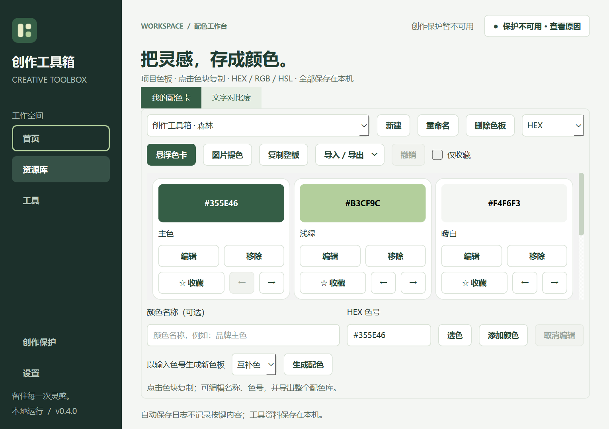
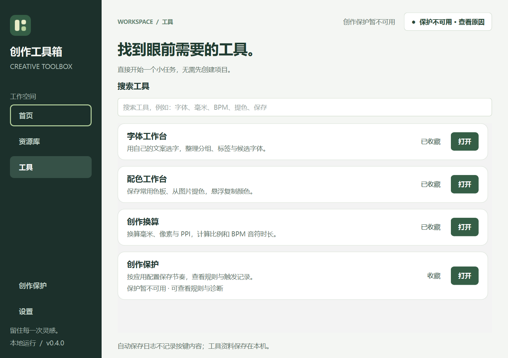

# 2026-09-22 · 0.7 冷白与钴蓝验收

本轮将用户确认的冷白＋钴蓝方案应用到全部模块，后文的森林绿记录是上一轮历史，不再作为当前视觉规范。当前规则见 [DESIGN.md](../DESIGN.md)。

- 原有 122 项测试与 8 项新增测试通过，共 130 项。新增覆盖外观保存和重新读取、坏数据/未来格式保留、原子替换失败、当前窗口降级、图标资源加载、复选框完整标签和文字对比度。
- 原生 Windows Qt 在 1180×800、1020×720 逻辑尺寸截图；当前屏幕缩放为 150%。检查首页、目录、资源入口、字体、配色、换算、保护、设置、帮助，以及有示例内容的图片库。另检查不透明模式、规则弹窗和悬浮色卡。
- 截图发现的滚动区灰底、下拉框旧边框、非当前导航焦点和复选框标签截断已修复。程序化截图使用隔离数据与不会发送按键的后端。
- Windows 本地独立程序已启动并生成自身截图。ZIP 的 CRC 完整性、内置模块、主题图片及 Phosphor 许可证已验证。
- 证据在 `artifacts/design-review/cobalt-final`、`artifacts/resource-review` 和 `artifacts/design-review/packaged-cobalt-startup.png`。对外截图位于 `assets/demo/`。
- macOS 真机安装、字体回退、系统缩放与辅助技术仍待验证；CI 通过仅证明构建与自动化测试通过。当前材质不实现原生 Liquid Glass 或桌面模糊。

---

# 2026-09-21 设计审阅与优化

## 安装与方法

Taste 的 13 个技能已安装到项目 `.agents/skills`。Designer Skills 指定的五组共 61 项技能已通过 Codex 安装脚本安装到同一位置：design-research 14、ux-strategy 12、ui-design 19、design-ops 9、designer-toolkit 7。安装的是 Codex 可读技能，不代表注册了 Claude 的 `/plugin` 命令。Taste 的来源由 skills-lock.json 记录；另 61 项来自 Owl-Listener/designer-skills/main，未写入 Skills CLI 的锁文件。

本轮应用 redesign-existing-projects、design-debt-audit、visual-hierarchy 和 ux-writing。采用现有 PySide6 实现，保留绿色品牌、原有导航和持久化数据格式。

## 范围与结果

Windows 原生 Qt 生成 8 个页面、2 种窗口尺寸的修改前后截图，共 32 张。证据位于 artifacts/design-review/before 与 after。截图来自隔离数据和不可发送按键的适配器，因此右上角“保护不可用”是审阅条件。

| 步骤 | 页面 | 判断及处理 |
| --- | --- | --- |
| 1 | 首页 | 基本健康；打开工具与收藏同等突出，现已强调打开、弱化收藏 |
| 2 | 工具目录 | 基本健康；新增持续显示的搜索标签，延用搜索及空状态 |
| 3 | 资源库 | 基本健康；沿用入口结构，与首页统一操作层级 |
| 4 | 配色 | 需改进项已修复：三排工具栏压缩为两排，增加固定字段标签，紧凑尺寸可看到完整首排色卡操作 |
| 5 | 换算 | 基本健康；宽高字段现在显示 mm / px，并随方向更新 |
| 6 | 字体 | 需改进项已修复：未选字体时禁用相关操作，单选启用详情，多选满足条件时启用对照 |
| 7 | 创作保护 | 降级状态健康，原因与禁用操作明确；本轮未发送任何保存按键 |
| 8 | 设置 | 基本健康；字段和操作层级清楚，增强辅助文字及焦点可见性 |

## 设计债务记录

| 问题 | 类别 / 严重度 | 覆盖 / 工作量 | 结果 |
| --- | --- | --- | --- |
| 配色工具栏拥挤，色卡操作落在折叠区 | 结构 / 中 | 配色主页面 / 低 | 已修复 |
| 颜色名称仅靠占位文字解释 | 可访问性 / 中 | 两个颜色输入 / 低 | 已补标签与可读名称 |
| 打开与收藏缺乏层级 | 视觉 / 中 | 三个入口页面 / 低 | 已修复 |
| 辅助文字偏淡 | 视觉 / 中 | 通用样式、字体列表 / 低 | 已加深 |
| 焦点样式覆盖不足 | 可访问性 / 中 | 通用按钮与输入 / 低 | 已补齐所涉控件，屏幕阅读器仍待实测 |
| 字体动作未表达选择约束 | 交互 / 中 | 三种选择操作 / 低 | 已修复并新增测试 |
| 换算输入缺少单位 | 文案 / 中 | 宽高两个输入 / 低 | 已修复并新增测试 |
| 字体目录首次进入同步扫描 | 性能 / 中 | 字体入口 / 高 | 后续专项；本轮未改线程模型 |
| 深色主题与高对比模式 | 视觉 / 中 | 全产品 / 高 | 待完整主题专项，当前沿用浅色主题 |
| 缺少用户研究数据 | 研究 / 未定 | 产品整体 | 不编造访谈、用户痛点频率或业务收益 |

## 验证与边界

84 项自动测试通过，包括 81 项现有测试及新增的配色编辑状态/菜单、换算单位、字体选择状态检查。原生截图复核了上表八个页面，配色布局调整后进行了二次修正。

本轮是主页面和相关交互的设计审阅，不是所有弹窗、所有字体、所有操作系统或所有辅助技术的完整认证。macOS、屏幕阅读器、高对比模式及真实外部应用保存兼容性未验证。截图中侧栏细描边表示键盘焦点，实色背景表示当前页面，两者可以不同。

## 查看结果

界面规范见 [DESIGN.md](../DESIGN.md)。上述审阅完成时未重新打包；其改动随后随 0.5.0 图片素材库一同纳入发布。素材库延续同一规范并补充正常 / 紧凑尺寸、空态与回收站截图检查。
