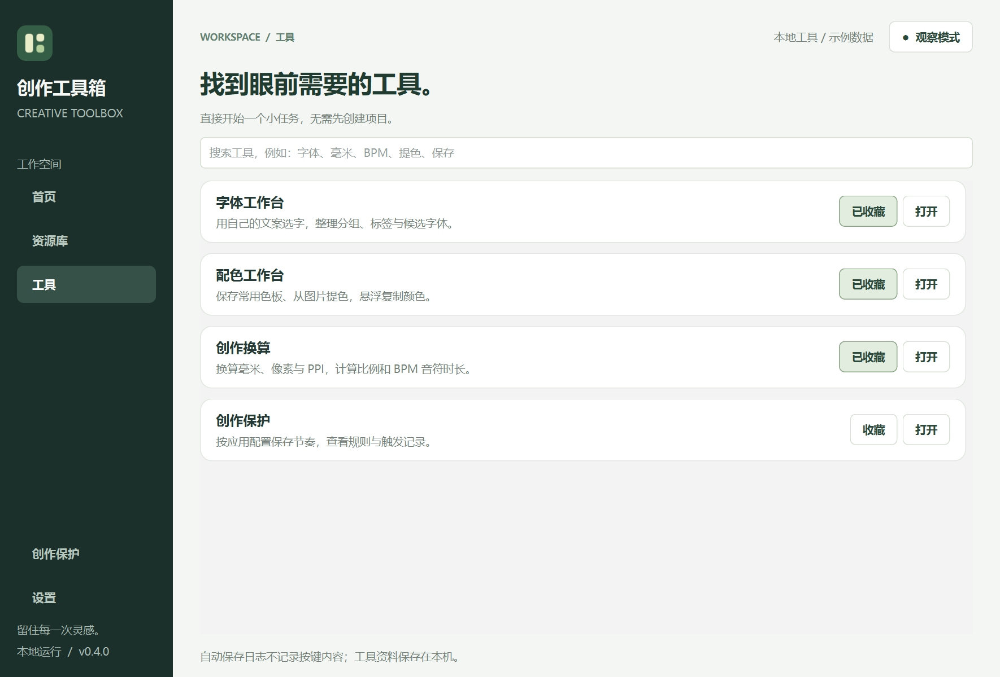

# 首页与工具入口（0.8.0）

工具按需打开，资料保存在本机。页面和导航提供短暂过渡，复制与保存后有轻提示；在设置中开启「减少动态效果」可立即关闭动画。

## 如何使用

- **首页**：从常用工具或最近使用继续工作。新安装默认收藏字体、配色、换算；可随时取消收藏。
- **资源库**：进入图片素材、字体库和色板。图片支持集合、备份与关联提色；已提供跨资源统一搜索和完整备份，见 [搜索与完整备份](RESOURCE_SEARCH_BACKUP.md)。
- **工具**：搜索名称与关键词，例如“毫米”“BPM”“提色”“字体”。点击收藏后会出现在首页；多词搜索要求同时匹配。
- **创作保护**：内部切换保护状态、应用规则、活动记录。右上角状态按钮也可进入。每次启动仍为观察模式。
- **设置**：设置保存快捷键，减少透明或动态效果，打开数据目录。

搜索条件在本次运行的页面切换间保留；收藏和最近使用会在重启后保留。最近使用仅记录工具标识及时间，不记录文案、窗口标题、文件路径或剪贴板。设置、字体与色板文件不因浏览首页、收藏工具而改写。

## 加载与错误处理

字体、配色和换算在第一次使用时创建，之后复用同一页面。切换入口不会重置编辑状态；托盘悬浮色卡复用同一配色模型。退出时不为了清理而创建未打开的工具，已打开字体页会保存待写偏好。

系统保存适配加载失败时仍可打开工具箱。保护状态显示原因，自动保存、暂停与前台捕获按钮禁用；字体、配色、换算可独立使用。权限状态仍由各平台已有适配报告。本版没有实现所有系统能力的统一权限管理。

某个工具创建失败时显示提示，其他工具仍可使用，之后可以重试。收藏写入失败不会显示为保存成功，也不会改变自动保存的开关。

## 数据与恢复

新增 `workspace.json` 只保存工具收藏与最近使用；采用版本校验和临时文件原子替换。损坏、超限或未知版本时保留原文件，禁止自动覆盖，仍允许打开工具。

本次动效更新不改变图片、字体、色板或保存规则的格式。外观选项单独保存在 `appearance.json`。各工具继续使用各自的备份功能。要备份当前全部本地配置，可退出程序后复制整个数据目录；恢复前退出程序、保留当前目录副本，再放回备份。该方法不包含系统字体文件，也不是统一的在线备份服务。图片库的专用备份和恢复见 [图片素材说明](ASSET_LIBRARY.md)。

## 验证记录

2026-09-18：81 项本地自动化测试通过，包含 15 项新测试，检查按需加载、页面复用、搜索、收藏与最近使用恢复、失败写入、旧数据保护、工具加载重试和保存适配降级。Windows 原生界面检查覆盖首页、目录、搜索、紧凑资源入口和降级状态。macOS 真机体验仍待验证。

初步启动样本（同一本机 Windows 环境、2056 个 Qt 字体家族、隔离空数据目录，不含打包解压和系统保存适配初始化）：

| 测量 | 改动前，两次独立进程 | 新首页，两次独立进程 |
| --- | --- | --- |
| 导入及 QApplication 初始化 | 123.6 / 110.3 ms | 90.8 / 92.7 ms |
| 主窗口构造 | 3451.2 / 2735.9 ms | 1854.9 / 1841.9 ms |
| 首次渲染（从导入前计时） | 4026.8 / 3016.3 ms | 2078.0 / 2069.6 ms |
| 新版首次进入字体页 | 已在启动时创建 | 938.2 / 939.4 ms |

这是小样本诊断，不是对所有设备的速度保证；缓存与系统状态影响结果。字体首次加载仍在 Qt 主线程，本版将其移出首页启动路径，未宣称已完成后台字体扫描。后续用固定设备与样本继续测量。

复测新版：`python -m tools.benchmark_workspace`。离屏模式用 `--offscreen`，但该环境可能没有真实字体，不能与原生数字直接比较。截图用 `python -m tools.capture_workspace`，仅使用工具箱自己的窗口与临时数据，不向其他软件发送按键。

下一步进入轻量项目资料夹：关联图片、色板、字体和项目规格。
